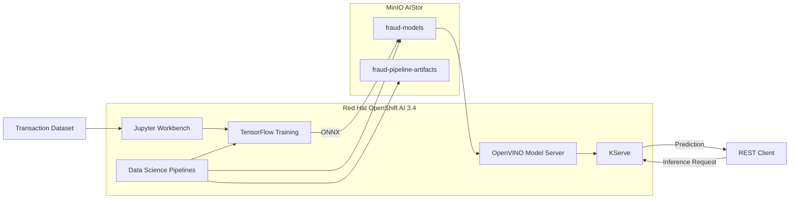

# Fraud Detection MLOps on Red Hat OpenShift AI

End-to-end fraud detection workflow on **Red Hat OpenShift AI 3.4**, covering model development, ONNX packaging, S3-compatible object storage, KServe/OpenVINO model serving, REST inference, and Data Science Pipelines.

The implementation runs on a self-hosted OpenShift lab and adapts the Red Hat OpenShift AI fraud detection tutorial to use **MinIO AIStor** and the existing platform infrastructure.

---

## Architecture

Screenshots:
OpenShift 4.22.5

Project Overview

Storage Connections

Object Storage

Jupyter Workbench

Model Training

Model Deployment

Normal Transaction

Fraud Detection

